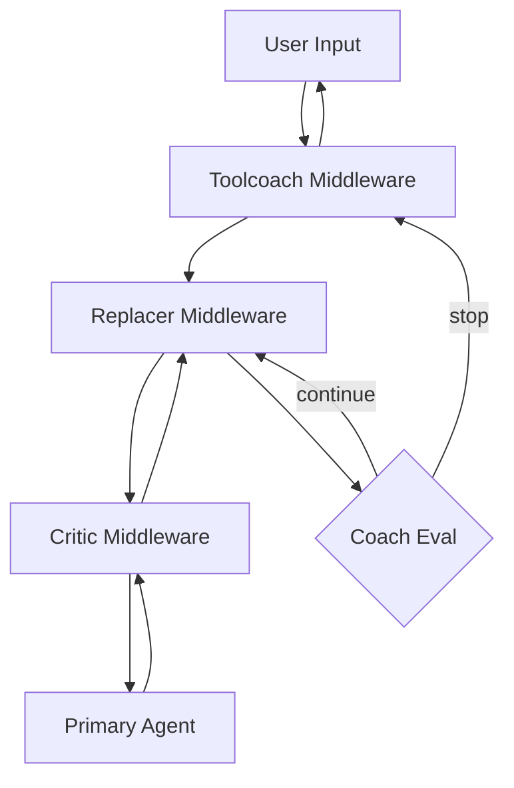
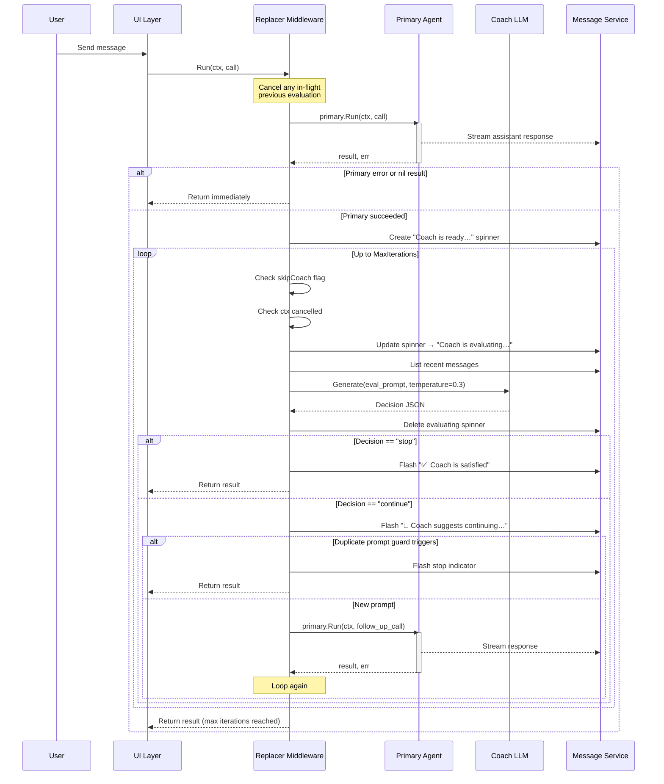
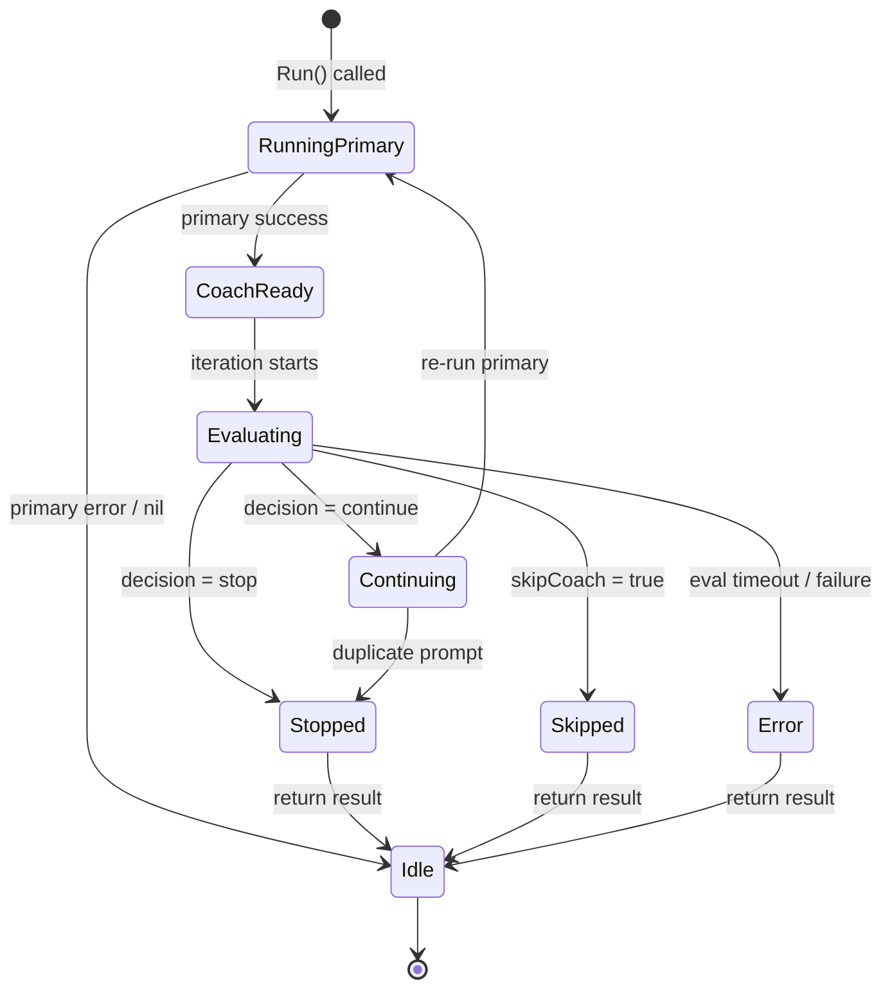
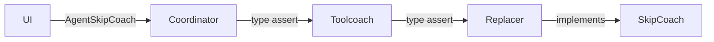
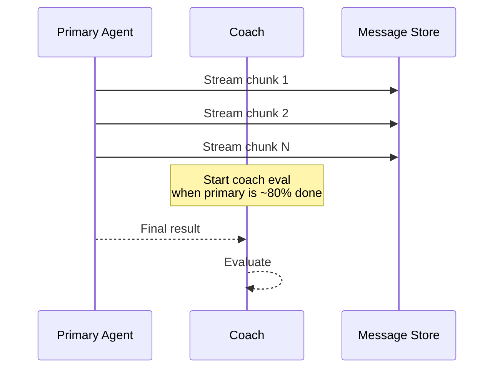

# Replacer Coach Mechanism: Specification & Adaptation Guide

> **Reference Implementation**: [Crush](https://github.com/charmbracelet/crush) (`internal/skills/replacer/`)
> **Language**: Go (generalizable to any language)

---

## 1. Executive Summary

The **Replacer Coach** (or "Conversation Coach") is a middleware pattern that wraps a primary AI agent. After the primary agent produces a response, a small, fast secondary LLM evaluates whether the conversation is complete or needs a follow-up prompt. This improves conversational flow without requiring the primary (often large/expensive) model to self-evaluate.

**Key properties:**
- **Non-blocking to primary**: The primary agent runs first, unchanged.
- **Fast evaluation**: Uses a small model (low latency, low cost).
- **Bounded iterations**: Max N coach loops per turn (default 3).
- **User-interruptible**: User can skip coach evaluation at any time.
- **Transparent to agent**: Follow-up prompts are injected as user messages.

---

## 2. Architecture Overview

### 2.1 Middleware Stack

The coach sits as a decorator around the primary agent. In a multi-skill system, it is typically placed **inside** outer skills (like tool coaching) and **outside** inner skills (like a critic reviewer).



### 2.2 Components

| Component | Responsibility |
|-----------|---------------|
| **Primary Agent** | Handles user prompts, tool calls, code generation |
| **Coach Evaluator** | Small LLM that reads conversation history and decides `stop` or `continue` |
| **Message Service** | Persists conversation messages; provides List/Create/Update/Delete |
| **Spinner Indicators** | UI feedback: "Coach is ready…" → "Coach is evaluating…" → "✅ Coach is satisfied" |
| **Config** | `enabled`, `model`, `max_iterations`, `timeout` |

---

## 3. Detailed Workflow

### 3.1 Sequence Diagram



### 3.2 State Machine



---

## 4. Core Concepts

### 4.1 Coach Decision Format

The coach LLM returns a **strict JSON object**:

```json
{"action":"stop","prompt":""}
```

or

```json
{"action":"continue","prompt":"What would you like help with today?"}
```

**Rules:**
- `action` MUST be exactly `"stop"` or `"continue"`.
- If `action` is `"stop"`, `prompt` MUST be `""`.
- If `action` is `"continue"`, `prompt` MUST be a natural, concise follow-up question (1 sentence).
- NEVER repeat a prompt that was already suggested in a previous turn.

**Parsing strategy** (robust to markdown fences):
1. Try direct `json.Unmarshal` on trimmed response.
2. If that fails, extract the first `{…}` block from markdown fences and retry.
3. Validate `action` is one of the allowed values.

### 4.2 Prompt Construction

The evaluation prompt contains:
- **System instructions**: Role definition, decision rules, output format.
- **Recent conversation history**: Last N messages (e.g., 4) — only the most recent exchange matters.
- **Examples**: Few-shot examples of stop vs continue scenarios.

**Key prompt engineering principles:**
- Be FAST and CONCISE.
- DEFAULT TO CONTINUE. Only stop if the response is genuinely complete.
- STOP only if ALL are true: specific question answered, working code/fix provided, explicit follow-up asked.
- CONTINUE if vague request, no follow-up asked, generic response, or under 50 words.

### 4.3 Follow-up Prompt Injection

When the coach decides `continue`, the follow-up prompt is injected as a **synthetic user message** into the conversation history. The primary agent then processes it as if the user had typed it.

**Prompt tagging** (to identify coach-generated prompts):
```
[Coach] What would you like help with today?
```

This tag is used by:
- **Duplicate detection**: Prevents repeating the same prompt across turns.
- **Telemetry**: Tracks coach effectiveness.
- **UI**: Can optionally render coach prompts differently.

### 4.4 Duplicate Prompt Guards

Two layers prevent repetitive follow-ups:

1. **In-memory dedup** (per `Run()` call): A `map[string]struct{}` tracks prompts used within the current evaluation loop.
2. **History scan** (across session): Before injecting a prompt, scan all prior session messages for the same prompt text (case-insensitive, whitespace-normalized).

If either guard triggers, the coach stops instead of continuing.

---

## 5. State Management

### 5.1 Busy Flags

The replacer maintains its own busy state, separate from the primary agent:

```
IsBusy() = replacer_busy OR primary.IsBusy()
```

`replacer_busy` is set to `true` just before the coach LLM call and `false` immediately after it returns. This allows the UI to show busy indicators during evaluation.

### 5.2 Cancellation

Three cancellation mechanisms work together:

| Mechanism | Trigger | Effect |
|-----------|---------|--------|
| **Context cancel** | Parent context cancelled (user cancels session) | Evaluation aborts, returns error |
| **Eval timeout** | Hard timeout on coach LLM call (default 10s) | Treated as `stop` (satisfied) rather than error |
| **User skip** | `SkipCoach()` called | Sets atomic flag, cancels eval context |

### 5.3 Concurrency Safety

- `evalCancel` (context.CancelFunc) is protected by a mutex.
- `evalSpinnerID` is protected by the same mutex.
- `skipCoach` is an atomic boolean.
- `busy` is an atomic boolean.

When a new `Run()` starts while a previous evaluation is still in-flight:
1. Lock `evalMu`.
2. Call `evalCancel()` if non-nil.
3. Capture old spinner ID, clear it.
4. Unlock.
5. Fire-and-forget delete the old spinner from the message store.

---

## 6. SkipCoach / User Interrupt

### 6.1 Mechanism

`SkipCoach` is a one-time interrupt that does NOT disable the replacer permanently:

1. User types `/skipcoach` (or clicks "Skip Coach" in commands dialog).
2. UI calls `AgentSkipCoach(sessionID)`.
3. Coordinator delegates through middleware chain via interface type-assertion.
4. Replacer's `SkipCoach()`:
   - Sets `skipCoach = true` (atomic).
   - Cancels `evalCancel` if non-nil.
5. The evaluation loop detects `skipCoach` and treats it as a clean user skip (not an error).
6. The flag is reset immediately after checking.

### 6.2 Propagation Through Middleware Chain



Every wrapper in the chain must delegate:

```go
func (m *Middleware) SkipCoach(sessionID string) {
    if s, ok := m.primary.(interface{ SkipCoach(string) }); ok {
        s.SkipCoach(sessionID)
    }
}
```

If any wrapper fails to delegate, the signal dies silently.

### 6.3 Auto-Interrupt on User Input

Modern implementations also auto-skip when the user interacts:

- **Typing any character**: Call `SkipCoach` so the user can take control.
- **Pressing Enter**: Call `SkipCoach` before sending the new message.
- **Running a command** (e.g., new session, model selection): Call `SkipCoach` and proceed immediately.

This ensures the coach never blocks user intent.

---

## 7. Configuration

```json
{
  "options": {
    "replacer": {
      "enabled": true,
      "model": "anthropic/claude-sonnet-4",
      "max_iterations": 3,
      "timeout": "10s"
    }
  }
}
```

| Field | Type | Default | Description |
|-------|------|---------|-------------|
| `enabled` | bool | true (if section present) | Master switch |
| `model` | string | small model from config | Coach LLM model identifier |
| `max_iterations` | int | 3 | Max coach loops per turn |
| `timeout` | duration | 10s | Hard timeout per evaluation |

**Environment overrides:**
- `CRUSH_REPLACER_FORCE_CONTINUE=1`: Forces `continue` decision (for testing).

---

## 8. Go Implementation Reference (Crush)

### 8.1 Middleware Struct

```go
type Middleware struct {
    primary      agent.SessionAgent   // wrapped primary agent
    cfg          ReplacerConfig       // runtime config
    messages     message.Service      // message persistence
    resolveModel func(ctx context.Context) (fantasy.LanguageModel, error)
    
    busy         atomic.Bool          // true during evaluate()
    evalCancel   context.CancelFunc   // cancels in-flight eval
    evalSpinnerID string              // tracks spinner message ID
    evalMu       sync.Mutex           // protects evalCancel + evalSpinnerID
    skipCoach    atomic.Bool          // one-time skip flag
}
```

### 8.2 Run Method

```go
func (m *Middleware) Run(ctx context.Context, call agent.SessionAgentCall) (*fantasy.AgentResult, error) {
    // Bypass if disabled or unwired.
    if !m.cfg.Enabled || m.messages == nil || m.resolveModel == nil {
        return m.primary.Run(ctx, call)
    }
    
    // Cancel any stale in-flight evaluation from a previous turn.
    m.evalMu.Lock()
    if m.evalCancel != nil {
        m.evalCancel()
        m.evalCancel = nil
    }
    oldSpinnerID := m.evalSpinnerID
    m.evalSpinnerID = ""
    m.evalMu.Unlock()
    if oldSpinnerID != "" {
        go deleteStaleSpinner(oldSpinnerID)
    }
    
    // Run primary agent.
    result, err, evalMsg := m.runPrimaryWithEval(ctx, call)
    if err != nil || result == nil {
        m.deleteEvalIndicator(evalMsg.ID)
        return result, err
    }
    
    // Coach evaluation loop.
    seenPrompts := make(map[string]struct{})
    for iteration := 0; iteration < m.cfg.MaxIterations; iteration++ {
        if ctx.Err() != nil {
            m.deleteEvalIndicator(evalMsg.ID)
            return result, nil
        }
        if m.skipCoach.Load() {
            m.skipCoach.Store(false)
            m.deleteEvalIndicator(evalMsg.ID)
            return result, nil // user skip
        }
        
        // Update spinner to "evaluating".
        evalMsg.SpinnerLabel = coachEvalLabel
        go updateSpinner(evalMsg)
        
        // Run evaluation with cancellable context.
        evalCtx, cancel := context.WithCancel(ctx)
        m.evalMu.Lock()
        m.evalCancel = cancel
        m.evalMu.Unlock()
        
        decision, evalErr := m.evaluate(evalCtx, call.SessionID, iteration)
        
        m.evalMu.Lock()
        m.evalCancel = nil
        m.evalMu.Unlock()
        m.deleteEvalIndicator(evalMsg.ID)
        
        // Handle errors.
        if evalErr != nil {
            if m.skipCoach.Load() { /* user skip */ return result, nil }
            if errors.Is(evalErr, context.DeadlineExceeded) { /* timeout = stop */ return result, nil }
            return result, nil // genuine error, logged but not fatal
        }
        
        // Handle decision.
        if decision == nil || decision.Action == "stop" {
            m.flashStopIndicator(ctx, call.SessionID)
            return result, nil
        }
        
        // Guard against duplicates.
        normalized := strings.ToLower(strings.TrimSpace(decision.Prompt))
        if _, dup := seenPrompts[normalized]; dup { return result, nil }
        seenPrompts[normalized] = struct{}{}
        if isDuplicateCoachPrompt(ctx, m.messages, call.SessionID, decision.Prompt) {
            return result, nil
        }
        
        // Continue: flash indicator and re-run primary.
        m.flashContinueIndicator(ctx, call.SessionID)
        newCall := call
        newCall.Prompt = coachPrompt(decision.Prompt) // "[Coach] …"
        newCall.Attachments = nil
        result, err, evalMsg = m.runPrimaryWithEval(ctx, newCall)
        if err != nil || result == nil {
            m.deleteEvalIndicator(evalMsg.ID)
            return result, err
        }
    }
    
    return result, nil // max iterations reached
}
```

### 8.3 Evaluate Method

```go
func (m *Middleware) evaluate(ctx context.Context, sessionID string, iteration int) (*Decision, error) {
    // Force-continue for testing.
    if os.Getenv("CRUSH_REPLACER_FORCE_CONTINUE") == "1" {
        return &Decision{Action: "continue", Prompt: "What would you like help with today?"}, nil
    }
    
    // Fetch recent messages with timeout.
    msgs, err := m.messages.List(ctx, sessionID)
    if err != nil { return nil, err }
    
    // Build prompt from template.
    promptText, err := BuildReplacerPrompt(msgs)
    if err != nil { return nil, err }
    
    // Resolve small model.
    model, err := m.resolveModel(ctx)
    if err != nil { return nil, err }
    
    // Mark busy.
    m.busy.Store(true)
    defer m.busy.Store(false)
    
    // Call coach LLM with hard timeout.
    ctx2, cancel := context.WithTimeout(ctx, m.cfg.Timeout)
    defer cancel()
    
    call := fantasy.Call{
        Prompt:          fantasy.Prompt{fantasy.NewUserMessage(promptText)},
        MaxOutputTokens: ptr(int64(512)),
        Temperature:     ptr(0.3),
    }
    resp, err := model.Generate(ctx2, call)
    if err != nil { return nil, err }
    
    // Parse decision.
    return ParseDecision(resp.Content.Text())
}
```

### 8.4 SkipCoach Implementation

```go
func (m *Middleware) SkipCoach(sessionID string) {
    m.skipCoach.Store(true)
    m.evalMu.Lock()
    if m.evalCancel != nil {
        m.evalCancel()
        m.evalCancel = nil
    }
    m.evalMu.Unlock()
}
```

### 8.5 IsBusy Implementation

```go
func (m *Middleware) IsBusy() bool {
    return m.busy.Load() || m.primary.IsBusy()
}

func (m *Middleware) IsSessionBusy(sessionID string) bool {
    return m.busy.Load() || m.primary.IsSessionBusy(sessionID)
}
```

---

## 9. Adaptation Guide

To port the Replacer Coach to another language or CLI tool:

### 9.1 Required Interfaces

Your primary agent must implement:

```
interface Agent {
    Run(ctx, call) -> (result, error)
    IsBusy() -> bool
    IsSessionBusy(sessionID) -> bool
    Cancel(sessionID)
    SetTools(tools)
    SetSystemPrompt(prompt)
    // … other delegation methods
}
```

Your message store must implement:

```
interface MessageService {
    List(ctx, sessionID) -> []Message
    Create(ctx, sessionID, params) -> Message
    Update(ctx, message) -> error
    Delete(ctx, messageID) -> error
    Subscribe(ctx) -> EventChannel
}
```

### 9.2 Porting Checklist

1. **Create Middleware Struct**
   - Embed primary agent.
   - Add config, message service, model resolver.
   - Add atomic `busy`, `skipCoach`.
   - Add mutex-protected `evalCancel` + `evalSpinnerID`.

2. **Implement `Run(ctx, call)`**
   - Bypass if disabled.
   - Cancel stale evaluation.
   - Run primary.
   - Loop up to `max_iterations`:
     - Check context + skip flag.
     - Update spinner.
     - Call `evaluate()`.
     - Handle stop/continue/duplicate.
   - Return result.

3. **Implement `evaluate(ctx, sessionID, iteration)`**
   - List recent messages.
   - Build prompt from template.
   - Resolve small model.
   - Generate with timeout.
   - Parse JSON decision.
   - Return decision.

4. **Implement `SkipCoach(sessionID)`**
   - Set atomic flag.
   - Cancel eval context.

5. **Implement Busy State**
   - `IsBusy()`: self busy OR primary busy.
   - Set busy before LLM call, clear after.

6. **Add UI Integration**
   - Spinner messages: ready → evaluating → satisfied/continuing.
   - `/skipcoach` command interception.
   - Auto-skip on user typing/Enter.
   - Commands dialog item.

7. **Add Prompt Template**
   - System instructions + decision rules.
   - Recent message history injection.
   - Output format specification (JSON).
   - Optional: project-local override file.

8. **Add Duplicate Guards**
   - In-memory map per `Run()`.
   - History scan across session.

9. **Add Telemetry (optional)**
   - Track decision types per iteration.
   - Track loop completion reasons.

### 9.3 Language-Specific Notes

| Concern | Go (Crush) | Python | Rust | TypeScript |
|---------|-----------|--------|------|------------|
| Cancellation | `context.Context` | `asyncio.CancelledError` | `tokio::select!` | `AbortController` |
| Atomic flag | `sync/atomic.Bool` | `threading.Event` | `AtomicBool` | `Atomics` |
| Mutex | `sync.Mutex` | `threading.Lock` | `std::sync::Mutex` | N/A (single-threaded) |
| Goroutines | `go func()` | `asyncio.create_task` | `tokio::spawn` | `Promise` |
| Prompt template | `text/template` | Jinja2 | `handlebars` | Mustache |

---

## 10. Self-Critic Review

### 10.1 Strengths

1. **Clean separation of concerns**: Primary agent is unchanged; coach is a pure decorator.
2. **Bounded loops**: `max_iterations` prevents infinite coach loops.
3. **Graceful degradation**: Timeouts treated as stop, errors logged but not fatal.
4. **User control**: SkipCoach is always available; auto-interrupt on input.
5. **Duplicate guards**: Both per-run and cross-session dedup prevent annoyance.
6. **Async cleanup**: Spinner deletion is fire-and-forget with retries.
7. **Template override**: Users can customize the coach prompt per project.

### 10.2 Weaknesses & Risks

1. **Synchronous re-run**: Each continue blocks until the primary finishes. Could stack latency.
   - *Mitigation*: Keep `max_iterations` low (3) and use fast small model.
2. **No async pre-warm**: Coach evaluation starts only after primary finishes.
   - *Potential improvement*: Start streaming primary response to coach while primary is still running.
3. **Global busy state**: `IsBusy()` includes coach evaluation, which can block unrelated UI actions.
   - *Mitigation*: Already addressed with `trySkipCoach()` — commands signal skip and proceed.
4. **Prompt repetition across sessions**: No global dedup across different sessions.
   - *Low risk*: Each session is independent.
5. **Hard-coded JSON format**: brittle if model ignores instructions.
   - *Mitigation*: Fallback parser extracts JSON from markdown fences.
6. **No feedback loop**: Coach decisions are not tracked to improve the prompt template.
   - *Potential improvement*: Log stop/continue ratios and A/B test prompt variants.

### 10.3 Testing Gaps

- No test for `max_iterations` boundary with rapid user input.
- No test for concurrent `SkipCoach` + `Run()` race.
- No test for malformed JSON that is neither valid JSON nor markdown-fenced.

### 10.4 Documentation Gaps

- Missing: How to tune `temperature` and `max_tokens` for different models.
- Missing: Guidance on choosing a coach model (latency vs quality trade-off).
- Missing: Troubleshooting guide for when coach is too aggressive/conservative.

---

## 11. Improvement Proposals

### 11.1 Streaming Pre-evaluation

Instead of waiting for the primary to fully finish, stream its output to the coach LLM incrementally. This overlaps primary generation with coach preparation, reducing perceived latency.



### 11.2 Adaptive Max Iterations

Use conversation history to predict how many iterations are typically needed:
- First user message → allow 3 iterations.
- Follow-up within same topic → allow 1 iteration.
- User explicitly says "that's all" → allow 0 iterations.

### 11.3 Coach Effectiveness Metrics

Track per-session:
- Stop rate vs continue rate.
- User skip rate (how often users manually skip).
- Average iterations per turn.
- Time spent in evaluation vs primary generation.

Expose via CLI: `crush coach stats --session <id>`

### 11.4 Prompt Versioning

Add a `prompt_version` field to the config and log which prompt version produced each decision. This enables A/B testing of prompt templates.

### 11.5 Multi-Model Coach Ensemble

Run two small models in parallel and only continue if BOTH agree. Reduces false-positives at the cost of 2x LLM calls.

---

## Appendix: Complete Prompt Template

```
You are a conversation coach evaluating an AI coding assistant's last response.
Your ONLY job is to decide: should the conversation CONTINUE (ask a follow-up) or STOP (the user has a clear next step)?

Be FAST and CONCISE. Self-criticize step by step:
(1) What did the assistant do well?
(2) What's missing or unclear?
(3) Does the user have a concrete next step?
Then decide STOP or CONTINUE.

DEFAULT TO CONTINUE. Only stop if the response is genuinely complete AND the user knows exactly what to do next.

## Most Recent Exchange

{{range .Messages}}
{{.Role}}: {{.Text}}
{{end}}

## Decision Rules

STOP only if ALL of these are true:
1. The assistant answered a specific, concrete coding question.
2. The response includes working code, specific file changes, or a clear actionable fix.
3. The assistant explicitly asked a concrete follow-up question about implementation details.

CONTINUE if ANY of these are true:
- The user's request was vague or broad.
- The assistant did NOT ask a specific follow-up question.
- The response is a dry summary or list without concrete next steps.
- The response is under 50 words or feels generic / incomplete.
- The user has not yet stated what they actually need help with.
- The assistant only greeted back or gave a social response.

## Output Format

Respond with ONLY this exact JSON. No markdown fences, no explanations:

{"action":"stop","prompt":""}
OR
{"action":"continue","prompt":"What would you like help with today?"}

Rules:
- action MUST be exactly "stop" or "continue".
- If action is "stop", prompt MUST be "".
- If action is "continue", prompt MUST be a natural, concise follow-up question.
- NEVER repeat a prompt that was already suggested in a previous turn.
- When in doubt, ALWAYS choose CONTINUE.
```

---

*Document version: 1.0*
*Based on Crush `internal/skills/replacer/` at commit `d3eaf09b`*
